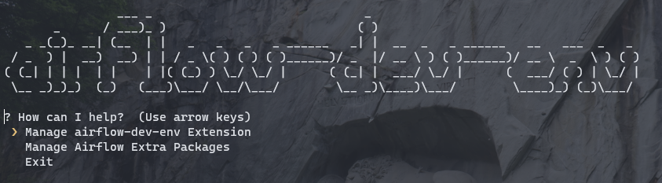

# airflow-dev-env
Your extensible development environment for data projects with [Apache Airflow](https://airflow.apache.org/).

* Close to a production environment
* Easily extensible
* Convenient development

**Alternatives** to this approach:
* Use Airflow natively via pip (not really an option on Windows)
* Use Airflow natively via WSL (works ok but not really convenient in my opinion)

**Advantages of this solution**:
* Having a local environment that is way closer to an actual production deployment
* Great development experience as DAGs and Plugins are directly mounted to the Airflow Docker Container. Develop on the host with your preferred IDE and directly see the results in your Docker environment

## How to set it up
Simply run `docker-compose up -d` and you're up and running.
If everything worked, your Airflow should be ready under `http://localhost:8080/`. You can further evaluate that everything works as expected, by executing the `example_dag`.

## Adding your own DAGs and Plugins
Your airflow instance is mounting the folders `airflow/dags` and `airflow/plugins` for you. So you can develop your scripts locally, and the Airflow docker container will pick them up and they are ready to use.

## Manage your airflow-dev-env

The [Manage CLI](./scripts/cli/manage.py) is your little helper to maximize the convenience when developing and integrating things with the airflow-dev-env.
It let's you:
* Add & start airflow-dev-env Extensions (like MongoDB)
* Add & manage Airflow Extra Packages

**Install:**
1. I would recommend to install the required packages into a venv using `python -m venv venv`
1. Install the required packages using `pip install -r requirements.txt`

### Adding Airflow Extra Packages
To install [Airflow Extra Packages](http://apache-airflow-docs.s3-website.eu-central-1.amazonaws.com/docs/apache-airflow/latest/extra-packages-ref.html) you can:
* Use the [Manage CLI](./scripts/cli/manage.py)
* Add the packages directly in the [Airflow Dockerfile](./docker/airflow/Dockerfile)

### Including airflow-dev-env Extensions
For convenience, there are additional extensions that you can integrate into this development environment.

Available extensions:
* [MongoDB Extensions](https://github.com/tfreundo/airflow-dev-env-mongodb)

You can add this extension easily via the [Manage CLI](./scripts/cli/manage.py).

These extensions are intentionally not included as git submodules to keep this development environment as clean as possible.
If you don't need these extensions, they won't show up!

## Troubleshooting
For known issues and their solutions see [Troubleshooting.md](Troubleshooting.md)