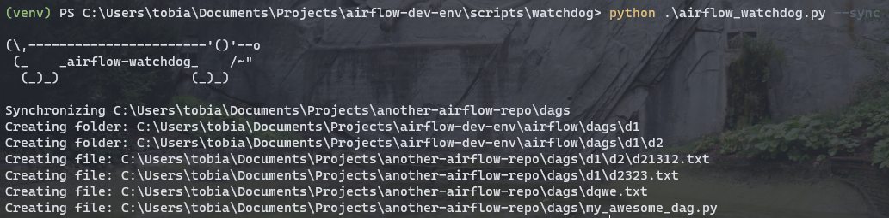

# External Repo Watchdog
The external repo Watchdog is useful, if you want to **develop and push your DAGs and Plugins** (Hooks, Operators and Sensors) not in this repository but in **your own, private or enterprise repository (cloned on your local machine)**.

You can run your own Watchdog using the [airflow_watchdog.py](scripts/airflow_watchdog/airflow_watchdog.py).

It will:
* Copy your DAGs and Plugins once if you add `--sync` like `python airflow_watchdog.py --sync`
* Sync your DAGs and Plugins continuously when just running `python airflow_watchdog.py`. Using this you can develop on your external repo (cloned on your local machine) and on every save there, it will be synced to this repository and will directly be available in your Airflow running in the `airflow-dev-env`. If that's not convenient ... ;)

## How to configure it
Simply open the [watchdog_config.json](scripts/airflow_watchdog/watchdog_config.json) and enter the **paths to your DAGs and Plugins** of your external repo (cloned on your local machine) or **leave it as an empty string if you don't want to sync**.

## First run
If it's you're first run, it makes sense to run `python airflow_watchdog.py --sync` once. This makes sure, that the `airflow-dev-env/airflow` folder is already in sync with your external repository.

Afterwards, you can just run `python airflow_watchdog.py`

## Example
Assume I have a separate Git repository for a project (private or corporate) called `another-airflow-repo` where I have the same structure as in the folder `airflow`, so the folders:
* dags
* plugins/hooks
* plugins/operators
* plugins/sensors

### The configuration
My configuration file looks like this:

```json
{
    "dags_source": "C:\\Users\\tfreundo\\Documents\\Projects\\another-airflow-repo\\dags",
    "hooks_source": "C:\\Users\\tfreundo\\Documents\\Projects\\another-airflow-repo\\plugins\\hooks",
    "operators_source": "C:\\Users\\tfreundo\\Documents\\Projects\\another-airflow-repo\\plugins\\operators",
    "sensors_source": "C:\\Users\\tfreundo\\Documents\\Projects\\another-airflow-repo\\plugins\\sensors"
}
```

If I for example just want to sync my DAGs, it would look like this:

```json
{
    "dags_source": "C:\\Users\\tfreundo\\Documents\\Projects\\another-airflow-repo\\dags",
    "hooks_source": "",
    "operators_source": "",
    "sensors_source": ""
}
```

### Trigger a sync once
Execute `python airflow_watchdog.py --sync`



### Start Watchdog (continuous sync)
Execute `python airflow_watchdog.py` and continuously sync your configured folders.


